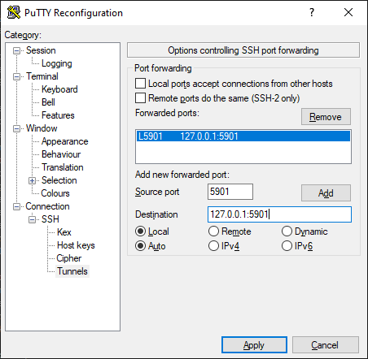
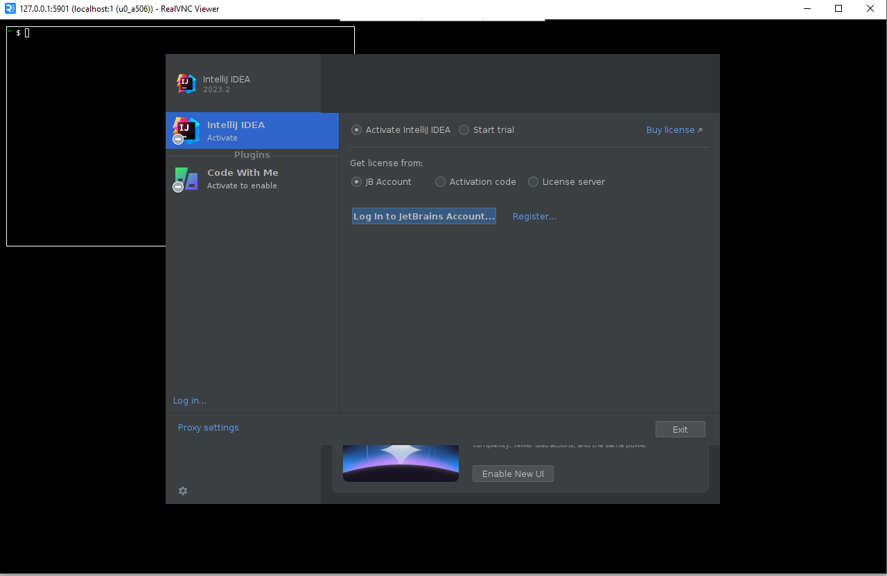
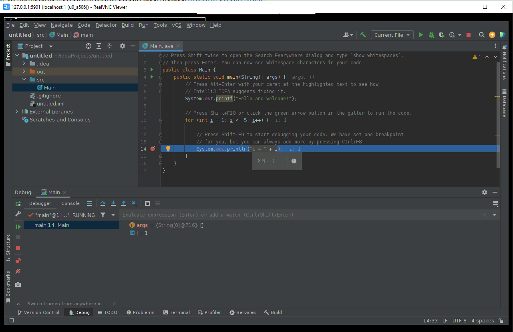
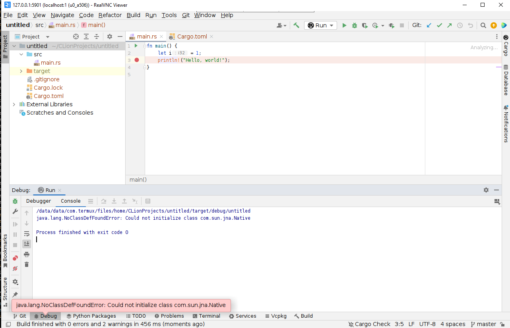
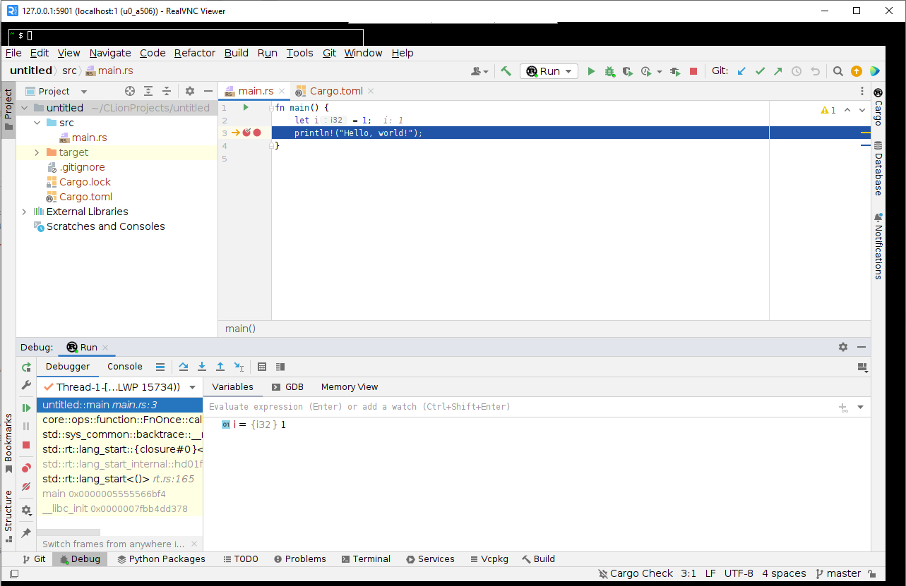

:hardbreaks-option:
= Запуск IDEA и CLion на Android
:toc:

== Введение

На современных Android телефонах и планшетах стоит отличное железо - многоядерные CPU с несколькими гигабайтами памяти.
Этого всего вполне хватит для запуска даже таких тяжеловесных программ как IDEA и CLion.

image::img/intro.png[]

== Termux
На Android можно запускать Linux-like окружение с некоторыми приложениями через Termux (https://github.com/termux/termux-app).
На хабре уже было несколько статей про него:
https://habr.com/en/articles/652633/[Код доступа Termux]
https://habr.com/en/articles/444950/[Termux шаг за шагом (Часть 1)]
https://habr.com/en/articles/445868/[Termux шаг за шагом (Часть 2)]
https://habr.com/en/companies/sportmaster_lab/articles/683242/[Превращаем старый телефон на Android в веб-сервер]

Но во всех этих статьях в Termux работали только из консоли. Сейчас же я расскажу как можно запустить полноценные IDE - IDEA и CLion - с полноценным UI на Android.

Я использую Samsung Galaxy Tab S6 (SM-T860/SM-T865) с диагональю 10.5"
https://www.mobile-review.com/articles/2019/samsung-galaxy-tab-s6.shtml[Статья с Mobile review о нём]
С дополнительной Bluetooth клавиатурой (не родной) с тачпадом - https://www.amazon.de/-/en/Bluetooth-Keyboard-Touchpad-Portable-Universal/dp/B08FWV1SYK[ссылка на Amazon]

== Установка и настройка

Для начала нужно скачать последние apk. Взять их можно из Actions для ветки master https://github.com/termux/termux-app/actions
На момент написание статьи это https://github.com/termux/termux-app/actions/runs/5932694275
Для последних версий Android нужно брать apk версии 7 (*-android-7-*) - в 5-ой версии нет многих пакетов.
Для моего планшета это будет termux-app_v0.118.0+eef5ac4-apt-android-7-github-debug_arm64-v8a
Дальше ничего сложно - скачиваем zip архив на телефон/планшет, разархивируем, ставим apk и запускаем.

Теперь поставим все пакеты которые нам понадобятся для работы - ssh, java, gcc, etc...

[source,bash,linenums]
----
#подключаем карту
$ termux-setup-storage
#обновляем зависимости
$ pkg upgrade
#репозиторий для gcc
$ pkg install tux-repo
#репозиторий для x11
$ pkg install x11-repo
#openssh - для remote connection
#openjdk-17 - java
#autoconf, automake, libtool, libffi-static, gcc-13 - для компиляции неработающих зависимостей
#termux-x11-nightly, tigervnc, fluxbox - для UI
#git, rust, gdb - для разработки
#proot-distro - для более комфортной работы IDE
$ pkg install openssh openjdk-17 autoconf automake libtool libffi-static gcc-13 termux-x11-nightly tigervnc git rust gdb proot-distro
----

Теперь я рекомендую настроить SSH (если вы выполняли команды выше, то он должен быть установлен) на Termux для удалённого подключения - настраивать будет немного приятнее.
На Termux Wiki есть отличная статья про то как это сделать: https://wiki.termux.com/wiki/Remote_Access

Далее устанавливаем пароль и запускаем ssh:
[source,bash,linenums]
----
$ passwd #устанавливаем пароль
New password:
Retype new password:
New password was successfully set.
$ sshd #запускаем ssh daemon
----

Можно соединиться через Putty по порту 8022.

image::img/putty_termux.png[]

== Запускаем IDE - sqlite и VNC

Сразу оговорюсь - большинство трудностей с последней версий IDE (IDEA/CLion) - 2023.2.x. Если вам нужна только Java и можете прожить на версии 2023.1.5 - то можно качать старую IDEA отсюда https://www.jetbrains.com/idea/download/other.html и запускать, указав только IDEA_JDK. Но я захотел воспользоваться продуктами JetBrains по полной (не зря же у меня полная подписка на все их IDE :-) )

Нам нужны Linux версии для архитектуры aarch64/ARM64: https://www.jetbrains.com/idea/download/other.html[IDEA], https://www.jetbrains.com/clion/download/other.html[CLion]
Скачиваем и переносим в папку Termux
[source,bash,linenums]
----
$ mkdir ide # папка для наших ide
$ cd ide
# копируем
~/ide $ cp /data/data/com.termux/files/home/storage/shared/Download/ideaIU-2023.2-aarch64.tar.gz ./
~/ide $ cp /data/data/com.termux/files/home/storage/shared/Download/CLion-2023.2.tar.gz ./
#разархивируем
~/ide $ tar -xf ./ideaIU-2023.2-aarch64.tar.gz
~/ide $ tar -xf ./CLion-2023.2.tar.gz
----

Пробуем запустить:
[source,bash,linenums]
----
~/ide $ /data/data/com.termux/files/home/ide/clion-2023.2/bin/clion.sh
/data/data/com.termux/files/home/ide/clion-2023.2/bin/clion.sh: 176: exec: /data/data/com.termux/files/home/ide/clion-2023.2/jbr/bin/java: not found
----
Нужно указать путь к Java. Делаем:
[source,bash,linenums]
----
#java для clion
export CLION_JDK=/data/data/com.termux/files/usr/opt/openjdk/
#и для idea
export IDEA_JDK=/data/data/com.termux/files/usr/opt/openjdk/
----

Запускаем и теперь следующий ошибка:
[source,bash,linenums]
----
~/ide $ /data/data/com.termux/files/home/ide/clion-2023.2/bin/clion.sh
libsqliteij error:
java.lang.AssertionError: Cannot create SvgCacheManager
        at com.intellij.openapi.diagnostic.DefaultLogger.error(DefaultLogger.java:54)
        at com.intellij.openapi.diagnostic.Logger.error(Logger.java:419)
        at com.intellij.ui.svg.SvgCacheManagerKt.createSvgCacheManager(SvgCacheManager.kt:62)
        at com.intellij.ui.svg.SvgCacheManagerKt$createSvgCacheManager$1.invokeSuspend(SvgCacheManager.kt)
        at kotlin.coroutines.jvm.internal.BaseContinuationImpl.resumeWith(ContinuationImpl.kt:33)
        at kotlinx.coroutines.internal.ScopeCoroutine.afterResume(Scopes.kt:32)
        at kotlinx.coroutines.AbstractCoroutine.resumeWith(AbstractCoroutine.kt:102)
        at kotlin.coroutines.jvm.internal.BaseContinuationImpl.resumeWith(ContinuationImpl.kt:46)
        at kotlinx.coroutines.DispatchedTask.run(DispatchedTask.kt:104)
        at kotlinx.coroutines.scheduling.CoroutineScheduler.runSafely(CoroutineScheduler.kt:584)
        at kotlinx.coroutines.scheduling.CoroutineScheduler$Worker.executeTask(CoroutineScheduler.kt:793)
        at kotlinx.coroutines.scheduling.CoroutineScheduler$Worker.runWorker(CoroutineScheduler.kt:697)
        at kotlinx.coroutines.scheduling.CoroutineScheduler$Worker.run(CoroutineScheduler.kt:684)
Caused by: java.lang.UnsatisfiedLinkError: /data/data/com.termux/files/home/ide/clion-2023.2/lib/native/linux-aarch64/libsqliteij.so: dlopen failed: library "libc.so.6" not found: needed by /data/data/com.termux/files/home/ide/clion-2023.2/lib/native/linux-aarch64/libsqliteij.so in namespace (default)
        at java.base/jdk.internal.loader.NativeLibraries.load(Native Method)
        at java.base/jdk.internal.loader.NativeLibraries$NativeLibraryImpl.open(NativeLibraries.java:384)
        at java.base/jdk.internal.loader.NativeLibraries.loadLibrary(NativeLibraries.java:228)
        at java.base/jdk.internal.loader.NativeLibraries.loadLibrary(NativeLibraries.java:170)
        at java.base/java.lang.ClassLoader.loadLibrary(ClassLoader.java:2389)
        at java.base/java.lang.Runtime.load0(Runtime.java:751)
        at java.base/java.lang.System.load(System.java:1912)
        at org.jetbrains.sqlite.SqliteLibLoaderKt.loadSqliteNativeLibrary(sqliteLibLoader.kt:42)
        at org.jetbrains.sqlite.SqliteLibLoaderKt.loadNativeDb(sqliteLibLoader.kt:30)
        at org.jetbrains.sqlite.SqliteConnection.<init>(SqliteConnection.kt:32)
        at org.jetbrains.sqlite.SqliteConnection.<init>(SqliteConnection.kt:21)
        at com.intellij.ui.svg.SvgCacheManagerKt.connectToSvgCache(SvgCacheManager.kt:76)
        at com.intellij.ui.svg.SvgCacheManagerKt.access$connectToSvgCache(SvgCacheManager.kt:1)
        at com.intellij.ui.svg.SvgCacheManagerKt$createSvgCacheManager$2$1.invokeSuspend(SvgCacheManager.kt:53)
        at kotlin.coroutines.jvm.internal.BaseContinuationImpl.resumeWith(ContinuationImpl.kt:33)
        at kotlinx.coroutines.Dispatche1dTask.run(DispatchedTask.kt:106)
        at kotlinx.coroutines.internal.LimitedDispatcher$Worker.run(LimitedDispatcher.kt:115)
        at kotlinx.coroutines.scheduling.TaskImpl.run(Tasks.kt:100)
        ... 4 more
----

Окей. Что-то новенькое. Гуглим - https://github.com/termux/termux-packages/issues/11606 https://wiki.termux.com/wiki/Differences_from_Linux
Проблема в glibc - в Linux используется Glibc https://en.wikipedia.org/wiki/Glibc а в Android - Bionic https://en.wikipedia.org/wiki/Bionic_(software)
И тут есть два варианта - попробовать поставить glibc https://github.com/termux-pacman/glibc-packages или перекомпилировать библиотеки чтобы они использовали нужные зависимости.
Я пробовал первый вариант https://github.com/termux-pacman/glibc-packages/issues/61  Он помог с некоторыми ошибками, но не со всеми.
В итоге сейчас я вам расскажу про второй.

Для начала узнаем что это за либа libsqliteij - следы ведут в IDEA https://github.com/search?q=repo%3AJetBrains%2Fintellij-community%20libsqliteij&type=code
Расчехляем git - будем скачивать исходники IDEA и перекомпилировать.

[source,bash,linenums]
----
~ $ git clone https://github.com/JetBrains/intellij-community.git
~ $ cd intellij-community/platform/sqlite/
----

Добавим опции линковщика, чтобы подключить некоторые зависимости. Без них проблема во время выполнения.
В файле make.sh заменить
linkFlags="-Wl,-S,-x"
на
linkFlags="-Wl,-S,-x,-lm,-lc,-ldl"

Дальше указываем OS, архитектуру и компилятор - с дефолтным clang ошибка во время выполнения "cannot locate symbol "log""

[source,bash,linenums]
----
~/intellij-community/platform/sqlite $ export OS=linux
~/intellij-community/platform/sqlite $ export ARCH=aarch64
~/intellij-community/platform/sqlite $ export CC=gcc-13
~/intellij-community/platform/sqlite $ ./make.sh
----

После компиляции копируем в IDEA и CLion
[source,bash,linenums]
----
~/intellij-community/platform/sqlite $ cp ./target/sqlite/linux-aarch64/libsqliteij.so /data/data/com.termux/files/home/ide/clion-2023.2/lib/native/linux-aarch64/
~/intellij-community/platform/sqlite $ cp ./target/sqlite/linux-aarch64/libsqliteij.so /data/data/com.termux/files/home/ide/idea-IU-232.8660.185/lib/native/linux-aarch64/
----

Запускаем:
[source,bash,linenums]
----
~/sqlite $ /data/data/com.termux/files/home/ide/clion-2023.2/bin/clion.sh
Start Failed
Unable to detect graphics environment
2023-08-18 22:13:27,505 [     95]   WARN - #c.i.i.AppStarter - Unable to load JNA library (os=Linux 4.14.190-26178195-abt865xxu5dwc3, jna.boot.library.path=/data/data/com.termux/files/home/ide/clion-2023.2/lib/jna/aarch64)
java.lang.UnsatisfiedLinkError: Unable to locate JNA native support library
        at com.sun.jna.Native.loadNativeDispatchLibrary(Native.java:1018)
        at com.sun.jna.Native.<clinit>(Native.java:221)
        at com.intellij.jna.JnaLoader.load(JnaLoader.java:19)
        at com.intellij.idea.StartupUtil$loadSystemLibsAndLogInfoAndInitMacApp$1$2.invokeSuspend(StartupUtil.kt:366)
        at kotlin.coroutines.jvm.internal.BaseContinuationImpl.resumeWith(ContinuationImpl.kt:33)
        at kotlinx.coroutines.DispatchedTask.run(DispatchedTask.kt:106)
        at kotlinx.coroutines.internal.LimitedDispatcher$Worker.run(LimitedDispatcher.kt:115)
        at kotlinx.coroutines.scheduling.TaskImpl.run(Tasks.kt:100)
        at kotlinx.coroutines.scheduling.CoroutineScheduler.runSafely(CoroutineScheduler.kt:584)
        at kotlinx.coroutines.scheduling.CoroutineScheduler$Worker.executeTask(CoroutineScheduler.kt:793)
        at kotlinx.coroutines.scheduling.CoroutineScheduler$Worker.runWorker(CoroutineScheduler.kt:697)
        at kotlinx.coroutines.scheduling.CoroutineScheduler$Worker.run(CoroutineScheduler.kt:684)
----

Ошибка "Unable to detect graphics environment" лечится просто - нужно запустить графическое окружение. В нашем случае это будет X11 или VNC. X11 вроде как работает быстрее и поддерживает GPU acceleration, но к сожалению copy-paste между Android и Termux работает только в одну сторону - из Termux в Android. Для меня это было критично так что я выбрал VNC.
Вот исчерпывающая статья по настройке VNC для Termux:
https://wiki.termux.com/wiki/Graphical_Environment

Если вы запускали команды в начале статьи, то VNC у вас уже установлен. Нужно только настроить его.
[source,bash,linenums]
----
~ $ vncserver -localhost
You will require a password to access your desktops.
Password:
Verify:
Would you like to enter a view-only password (y/n)? n

New 'localhost:1 ()' desktop is localhost:1

Creating default startup script /data/data/com.termux/files/home/.vnc/xstartup
Creating default config /data/data/com.termux/files/home/.vnc/config
Starting applications specified in /data/data/com.termux/files/home/.vnc/xstartup
Log file is /data/data/com.termux/files/home/.vnc/localhost:1.log
----
Он откроется на порту 5901 для DISPLAY = 1, 5902 - для 2 и тд.

В качестве VNC клиента для Windows и Android и выбрал RealVNC Viewer
https://www.realvnc.com/en/connect/download/viewer/
https://play.google.com/store/apps/details?id=com.realvnc.viewer.android

Ну ещё у себя я настроил port forwarding для VNC - чтобы VNC клиент соединялся по localhost. Но это не принципиально.

Далее устанавливаем переменную окружения DISPLAY и запускаем IDE:
[source,bash,linenums]
----
~ $ export DISPLAY=":1"
~ $ export CLION_JDK=/data/data/com.termux/files/usr/opt/openjdk/
~ $ /data/data/com.termux/files/home/ide/clion-2023.2/bin/clion.sh
----

Если у вас ошибка с SvgCacheManager, то нужно добавить -Didea.ui.icons.svg.disk.cache=false в clion64.vmoptions и idea64.vmoptions:
[source,bash,linenums]
----
~ $ /data/data/com.termux/files/home/ide/idea-IU-232.8660.185/bin/idea.sh
CompileCommand: exclude com/intellij/openapi/vfs/impl/FilePartNodeRoot.trieDescend bool exclude = true
ERROR: Cannot create SvgCacheManager
java.lang.UnsatisfiedLinkError: 'int org.jetbrains.sqlite.NativeDB.open(byte[], int)'
        at org.jetbrains.sqlite.NativeDB.open(Native Method)
        at org.jetbrains.sqlite.NativeDB.open(NativeDB.kt:59)
        at org.jetbrains.sqlite.SqliteConnection.<init>(SqliteConnection.kt:36)
        at org.jetbrains.sqlite.SqliteConnection.<init>(SqliteConnection.kt:21)
        at com.intellij.ui.svg.SvgCacheManagerKt.connectToSvgCache(SvgCacheManager.kt:76)
        at com.intellij.ui.svg.SvgCacheManagerKt.access$connectToSvgCache(SvgCacheManager.kt:1)
        at com.intellij.ui.svg.SvgCacheManagerKt$createSvgCacheManager$2$1.invokeSuspend(SvgCacheManager.kt:53)
        at kotlin.coroutines.jvm.internal.BaseContinuationImpl.resumeWith(ContinuationImpl.kt:33)
        at kotlinx.coroutines.DispatchedTask.run(DispatchedTask.kt:106)
        at kotlinx.coroutines.internal.LimitedDispatcher$Worker.run(LimitedDispatcher.kt:115)
        at kotlinx.coroutines.scheduling.TaskImpl.run(Tasks.kt:100)
        at kotlinx.coroutines.scheduling.CoroutineScheduler.runSafely(CoroutineScheduler.kt:584)
        at kotlinx.coroutines.scheduling.CoroutineScheduler$Worker.executeTask(CoroutineScheduler.kt:793)
        at kotlinx.coroutines.scheduling.CoroutineScheduler$Worker.runWorker(CoroutineScheduler.kt:697)
        at kotlinx.coroutines.scheduling.CoroutineScheduler$Worker.run(CoroutineScheduler.kt:684)

Start Failed
Internal error. Please refer to https://jb.gg/ide/critical-startup-errors

java.lang.AssertionError: Cannot create SvgCacheManager
        at com.intellij.openapi.diagnostic.DefaultLogger.error(DefaultLogger.java:54)
        at com.intellij.openapi.diagnostic.Logger.error(Logger.java:419)
        at com.intellij.ui.svg.SvgCacheManagerKt.createSvgCacheManager(SvgCacheManager.kt:62)
        at com.intellij.ui.svg.SvgCacheManagerKt$createSvgCacheManager$1.invokeSuspend(SvgCacheManager.kt)
        at kotlin.coroutines.jvm.internal.BaseContinuationImpl.resumeWith(ContinuationImpl.kt:33)
        at kotlinx.coroutines.internal.ScopeCoroutine.afterResume(Scopes.kt:32)
        at kotlinx.coroutines.AbstractCoroutine.resumeWith(AbstractCoroutine.kt:102)
        at kotlin.coroutines.jvm.internal.BaseContinuationImpl.resumeWith(ContinuationImpl.kt:46)
        at kotlinx.coroutines.DispatchedTask.run(DispatchedTask.kt:104)
        at kotlinx.coroutines.scheduling.CoroutineScheduler.runSafely(CoroutineScheduler.kt:584)
        at kotlinx.coroutines.scheduling.CoroutineScheduler$Worker.executeTask(CoroutineScheduler.kt:793)
        at kotlinx.coroutines.scheduling.CoroutineScheduler$Worker.runWorker(CoroutineScheduler.kt:697)
        at kotlinx.coroutines.scheduling.CoroutineScheduler$Worker.run(CoroutineScheduler.kt:684)
Caused by: java.lang.UnsatisfiedLinkError: 'int org.jetbrains.sqlite.NativeDB.open(byte[], int)'
        at org.jetbrains.sqlite.NativeDB.open(Native Method)
        at org.jetbrains.sqlite.NativeDB.open(NativeDB.kt:59)
        at org.jetbrains.sqlite.SqliteConnection.<init>(SqliteConnection.kt:36)
        at org.jetbrains.sqlite.SqliteConnection.<init>(SqliteConnection.kt:21)
        at com.intellij.ui.svg.SvgCacheManagerKt.connectToSvgCache(SvgCacheManager.kt:76)
        at com.intellij.ui.svg.SvgCacheManagerKt.access$connectToSvgCache(SvgCacheManager.kt:1)
        at com.intellij.ui.svg.SvgCacheManagerKt$createSvgCacheManager$2$1.invokeSuspend(SvgCacheManager.kt:53)
        at kotlin.coroutines.jvm.internal.BaseContinuationImpl.resumeWith(ContinuationImpl.kt:33)
        at kotlinx.coroutines.DispatchedTask.run(DispatchedTask.kt:106)
        at kotlinx.coroutines.internal.LimitedDispatcher$Worker.run(LimitedDispatcher.kt:115)
        at kotlinx.coroutines.scheduling.TaskImpl.run(Tasks.kt:100)
        ... 4 more
----

Наконец вы сможете увидеть стартовый экран:

Создадим простой проект и запустим сразу с debug, чтобы проверить все возможности разработки:

Всё работает!
Теперь попробуем запустить CLion с debug:

Не работает JNA. Буем фиксить по аналогии с sqlite.

== JNA в Termux

Чтобы пересобрать libjnidispatch.so из JNA нужно сначала узнать версию libjnidispatch.so которая используется в IDE. Это именно версия JNI библиотеки в JNA, не сама версия JNA. Если собрать просто последнюю версию, то IDE не запустится с ошибкой.

Посмотреть текущую версию JNI можно в <IDE>/lib/util-8.jar/com/sun/jna/Version.class
Для IDEA/CLion 2023.2.0 это 6.1.4.
Теперь скачаем JNA и найдём native версию 6.1.4 в файле build.xml (строки 79-81, переменные jni.major, jni.minor, jni.revision)
[source,bash,linenums]
----
~ $ git clone https://github.com/java-native-access/jna.git
~ $ cd jna
~/jna $ git log -L79,81:./build.xml

commit f6ebc9f3314e016094b7e1c784e68998c63de895
Author: Matthias Bläsing <mblaesing@doppel-helix.eu>
Date:   Sun Jun 5 19:53:06 2022 +0200

    Rebuild native libraries

diff --git a/build.xml b/build.xml
--- a/build.xml
+++ b/build.xml
@@ -77,4 +77,4 @@
   <property name="jni.major" value="6"/>
   <property name="jni.minor" value="1"/>
-  <property name="jni.revision" value="3"/>
+  <property name="jni.revision" value="4"/>
   <property name="jni.build" value="0"/> <!--${build.number}-->
----

Нам нужен коммит f6ebc9f3314e016094b7e1c784e68998c63de895. Выполняем checkout и собираем:
[source,bash,linenums]
----
~/jna $ git checkout f6ebc9f3314e016094b7e1c784e68998c63de895
~/jna $ ant -Dos.prefix=android-aarch64
----

Ошибка с libffi:
[source,bash,linenums]
----
     [exec] make: *** [Makefile:510: /data/data/com.termux/files/home/jna/build/native-android-aarch64/libffi/.libs/libffi.a] Error 1
----

Так как мы ранее ставили libffi-static то просто копируем его в ожидаемое место и заново запускаем сборку:
[source,bash,linenums]
----
~/jna $ mkdir -p /data/data/com.termux/files/home/jna/build/native-android-aarch64/libffi/.libs/
~/jna $ cp /data/data/com.termux/files/usr/lib/libffi.a /data/data/com.termux/files/home/jna/build/native-android-aarch64/libffi/.libs/libffi.a
~/jna $ ant -Dos.prefix=android-aarch64
----

Запускаем дальше:
[source,bash,linenums]
----
     [exec] aarch64-linux-android-gcc --sysroot /Developer/Applications/android-ndk-r10e/platforms/android-21/arch-arm64 -W -Wall -Wno-unused -Wno-parentheses  -O2 -fno-omit-frame-pointer -fno-strict-aliasing -fpic -ffunction-sections -funwind-tables -fno-short-enums  -DNO_JAWT -DNO_WEAK_GLOBALS -DFFI_MMAP_EXEC_WRIT=1 -DFFI_MMAP_EXEC_SELINUX=0  -I"/data/data/com.termux/files/home/jna/build/headers" -I/data/data/com.termux/files/home/jna/build/native-android-aarch64/libffi/include -I"/Developer/Applications/android-ndk-r10e/platforms/android-21/arch-arm64/usr/include"  -DJNA_JNI_VERSION='"6.1.4"' -DCHECKSUM='"147a998f0cbc89681a1ae6c0dd121629"' -Wno-unknown-warning-option -Werror -Wno-clobbered -Wno-unused-variable -c dispatch.c -o /data/data/com.termux/files/home/jna/build/native-android-aarch64/dispatch.o
     [exec] In file included from dispatch.c:30:
     [exec] ./dispatch.h:29:10: fatal error: 'ffi.h' file not found
     [exec] #include "ffi.h"
     [exec]          ^~~~~~~
     [exec] 1 error generated.
     [exec] make: *** [Makefile:463: /data/data/com.termux/files/home/jna/build/native-android-aarch64/dispatch.o] Error 1

BUILD FAILED
/data/data/com.termux/files/home/jna/build.xml:1127: exec returned: 2
----

Нехватает заголовочных файлов. Добавляем в native/Makefile, строка 178:
[source,makefile,linenums]
----
CINCLUDES+=-I"$(NDK_PLATFORM)/arch-$(AARCH)/usr/include" -I"/data/data/com.termux/files/usr/include/" # -I/usr/include
----

Запускаем ant заново:
[source,bash,linenums]
----
native:
     [exec] aarch64-linux-android-gcc --sysroot /Developer/Applications/android-ndk-r10e/platforms/android-21/arch-arm64 -W -Wall -Wno-unused -Wno-parentheses  -O2 -fno-omit-frame-pointer -fno-strict-aliasing -fpic -ffunction-sections -funwind-tables -fno-short-enums  -DNO_JAWT -DNO_WEAK_GLOBALS -DFFI_MMAP_EXEC_WRIT=1 -DFFI_MMAP_EXEC_SELINUX=0  -I"/data/data/com.termux/files/home/jna/build/headers" -I/data/data/com.termux/files/home/jna/build/native-android-aarch64/libffi/include -I"/Developer/Applications/android-ndk-r10e/platforms/android-21/arch-arm64/usr/include" -I"/data/data/com.termux/files/usr/include/"  -DJNA_JNI_VERSION='"6.1.4"' -DCHECKSUM='"147a998f0cbc89681a1ae6c0dd121629"' -Wno-unknown-warning-option -Werror -Wno-clobbered -Wno-unused-variable -c dispatch.c -o /data/data/com.termux/files/home/jna/build/native-android-aarch64/dispatch.o
     [exec] In file included from dispatch.c:98:
     [exec] In file included from /data/data/com.termux/files/usr/include/stdlib.h:276:
     [exec] /data/data/com.termux/files/usr/include/android/legacy_stdlib_inlines.h:96:77: error: unused parameter '__l' [-Werror,-Wunused-parameter]
     [exec] static __inline double strtod_l(const char* __s, char** __end_ptr, locale_t __l) {
     [exec]                                                                             ^
     [exec] /data/data/com.termux/files/usr/include/android/legacy_stdlib_inlines.h:100:76: error: unused parameter '__l' [-Werror,-Wunused-parameter]
     [exec] static __inline float strtof_l(const char* __s, char** __end_ptr, locale_t __l) {
     [exec]                                                                            ^
     [exec] /data/data/com.termux/files/usr/include/android/legacy_stdlib_inlines.h:104:87: error: unused parameter '__l' [-Werror,-Wunused-parameter]
     [exec] static __inline long strtol_l(const char* __s, char** __end_ptr, int __base, locale_t __l) {
     [exec]                                                                                       ^
     [exec] 3 errors generated.
     [exec] make: *** [Makefile:463: /data/data/com.termux/files/home/jna/build/native-android-aarch64/dispatch.o] Error 1

BUILD FAILED
/data/data/com.termux/files/home/jna/build.xml:1127: exec returned: 2
----

Теперь ошибки с unused parameter. Ок. Просто добавляем параметры компиляции для игнорирования этой ошибки в native/Makefile, строка 97:
[source,makefile,linenums]
----
PCFLAGS=-W -Wall -Wno-unused -Wno-parentheses -Wno-unused-parameter
----

Наконец всё собирается. Копируем библиотеку libjnidispatch.so:
[source,bash,linenums]
----
~ $ cp jna/build/native-android-aarch64/libjnidispatch.so ide/clion-2023.2/lib/jna/aarch64/
----

Запускам CLion и опять пробуем запустить debug:
[source,bash,linenums]
----
        Suppressed: java.lang.UnsatisfiedLinkError: dlopen failed: library "libc.so.6" not found: needed by /data/data/com.termux/files/home/ide/clion-2023.2/lib/pty4j/linux/aarch64/libpty.so in namespace (default)
                at com.sun.jna.Native.open(Native Method)
                at com.sun.jna.NativeLibrary.loadLibrary(NativeLibrary.java:197)
                ... 28 more
        Suppressed: java.lang.UnsatisfiedLinkError: dlopen failed: library "libc.so.6" not found: needed by /data/data/com.termux/files/home/ide/clion-2023.2/lib/pty4j/linux/aarch64/libpty.so in namespace (default)
                at com.sun.jna.Native.open(Native Method)
                at com.sun.jna.NativeLibrary.loadLibrary(NativeLibrary.java:210)
                ... 28 more
        Suppressed: java.io.IOException: Native library (data/data/com.termux/files/home/ide/clion-2023.2/lib/pty4j/linux/aarch64/libpty.so) not found in resource path (/data/data/com.termux/files/home/ide/clion-2023.2/lib/platform-loader.jar:/data/data/com.termux/files/home/ide/clion-2023.2/lib/util.jar:/data/data/com.termux/files/home/ide/clion-2023.2/lib/app.jar:/data/data/com.termux/files/home/ide/clion-2023.2/lib/util-8.jar:/data/data/com.termux/files/home/ide/clion-2023.2/lib/util_rt.jar:/data/data/com.termux/files/home/ide/clion-2023.2/lib/jps-model.jar:/data/data/com.termux/files/home/ide/clion-2023.2/lib/stats.jar:/data/data/com.termux/files/home/ide/clion-2023.2/lib/protobuf.jar:/data/data/com.termux/files/home/ide/clion-2023.2/lib/external-system-rt.jar:/data/data/com.termux/files/home/ide/clion-2023.2/lib/intellij-test-discovery.jar:/data/data/com.termux/files/home/ide/clion-2023.2/lib/forms_rt.jar:/data/data/com.termux/files/home/ide/clion-2023.2/lib/rd.jar:/data/data/com.termux/files/home/ide/clion-2023.2/lib/externalProcess-rt.jar:/data/data/com.termux/files/home/ide/clion-2023.2/lib/annotations-java5.jar:/data/data/com.termux/files/home/ide/clion-2023.2/lib/app-client.jar:/data/data/com.termux/files/home/ide/clion-2023.2/lib/async-profiler.jar:/data/data/com.termux/files/home/ide/clion-2023.2/lib/bouncy-castle.jar:/data/data/com.termux/files/home/ide/clion-2023.2/lib/byte-buddy-agent.jar:/data/data/com.termux/files/home/ide/clion-2023.2/lib/error-prone-annotations.jar:/data/data/com.termux/files/home/ide/clion-2023.2/lib/groovy.jar:/data/data/com.termux/files/home/ide/clion-2023.2/lib/grpc.jar:/data/data/com.termux/files/home/ide/clion-2023.2/lib/intellij-coverage-agent-1.0.723.jar:/data/data/com.termux/files/home/ide/clion-2023.2/lib/jetbrains-annotations.jar:/data/data/com.termux/files/home/ide/clion-2023.2/lib/jsch-agent.jar:/data/data/com.termux/files/home/ide/clion-2023.2/lib/junit4.jar:/data/data/com.termux/files/home/ide/clion-2023.2/lib/junit5.jar:/data/data/com.termux/files/home/ide/clion-2023.2/lib/lib-client.jar:/data/data/com.termux/files/home/ide/clion-2023.2/lib/lib.jar:/data/data/com.termux/files/home/ide/clion-2023.2/lib/modules.jar:/data/data/com.termux/files/home/ide/clion-2023.2/lib/product-client.jar:/data/data/com.termux/files/home/ide/clion-2023.2/lib/product.jar)
                at com.sun.jna.Native.extractFromResourcePath(Native.java:1145)
                at com.sun.jna.NativeLibrary.loadLibrary(NativeLibrary.java:281)
                ... 28 more
----

== PTY4J - so и jar

Теперь ошибка в библиотеке libpty.so. pty4j - это библиотека от JetBrains для удобного запуска консольных приложений. Что ж теперь её черёд:
[source,bash,linenums]
----
~ $ git clone  https://github.com/JetBrains/pty4j.git
~ $ cd ~/pty4j/native
~/pty4j/native $ make -f Makefile_linux linux_aarch64
----

Копируем, перезапускаем IDE и debug:

[source,bash,linenums]
----
/pty4j/native $ cp ../os/linux/aarch64/libpty.so ~/ide/clion-2023.2/lib/pty4j/linux/aarch64/
----

Теперь ошибка с загрузкой libutil.so:

[source,bash,linenums]
----
Suppressed: java.lang.UnsatisfiedLinkError: dlopen failed: library "libutil.so" not found
            at com.sun.jna.Native.open(Native Method)
            at com.sun.jna.NativeLibrary.loadLibrary(NativeLibrary.java:197)
            ... 28 more
    Suppressed: java.lang.UnsatisfiedLinkError: dlopen failed: library "libutil.so" not found
            at com.sun.jna.Native.open(Native Method)
            at com.sun.jna.NativeLibrary.loadLibrary(NativeLibrary.java:210)
            ... 28 more
----

Это всё ещё pty4j, но другое место:
https://github.com/JetBrains/pty4j/blob/master/src/com/pty4j/unix/linux/OSFacadeImpl.java#L79

[source,java]
----
  public interface Linux_Util_lib extends Library {
    int login_tty(int fd);
  }
//...
  private static final Linux_Util_lib m_Utillib = Native.loadLibrary("util", Linux_Util_lib.class);
----

Linux имплементация пытается загрузить util библиотеку, но не находит её в Termux. Но она есть в библиотека "c", которая уже используется в этом коде! Для этого переносим единственную функцию "int login_tty(int fd);" из Linux_Util_lib в C_lib и удаляем все упоминания Linux_Util_lib из OSFacadeImpl заменяя её также в месте использования:
[source,java]
----
  private interface C_lib extends Library {
//...
    int login_tty(int fd);
  }

  @Override
  public int login_tty(int fd) {
    return m_Clib.login_tty(fd);
  }
----

И собираем jar без тестов:
[source,bash,linenums]
----
~/pty4j $ gradlew -x tests -x testJar
----

Копируем получившийся jar в папку <IDE>/lib и добавляем в idea.sh/clion.sh этот файл в classpath в начало:
[source,bash,linenums]
----
~ $ cp ~/pty4j/build/libs/pty4j-0.12.13.jar ~/ide/clion-2023.2/lib/
----

CLASS_PATH="$IDE_HOME/lib/pty4j-0.12.13.jar:$IDE_HOME/lib/platform-loader.jar"

Опять перезапускаем и запускаем debug, всё работает!

== Немного удобства - proot, window manager
В IDE запущенных по-умолчанию из Termux плохо работают диалоги открытия файлов, так как корневая файловая система недоступна. Для это нужно запустить IDE через proot:
https://wiki.termux.com/wiki/PRoot

Это в какой-то степени эмулятор root окружения - приложения будут думать что работают под root'ом. На самом деле root доступа не будет.

И если запустить IDE как есть, сразу после VNC/X11 - вокруг окна будут чёрные рамки. Для исправления этого нужно сначала запуститесь window manager.
https://wiki.termux.com/wiki/Graphical_Environment
Я использовал Fluxbox.

== Мои команды для запуска:
Здесь я приведу все команды которые использую для запуска IDEA/CLion. Для удобства их можно поместить в sh файл или добавить (export) добавить в bashrc:
[source,bash,linenums]
----
#запуск proot
~ $ proot-distro login ubuntu --shared-tmp
#указываем дисплей и запускаем VNC
# с разрешением равным половинному разрешению моего планшета, что бы всё было не так мелко и не пришлось заниматься масштабированием (ну и чтобы ресурсы не тратились на отрисовку)
~ $ export DISPLAY=":1"
~ $ vncserver -localhost -geometry 1280x800 -depth 24
#указываем java для IDEA - для компиляции java и для запуска самой IDE и для запуска CLion
~ $ export JAVA_HOME=/data/data/com.termux/files/usr/opt/openjdk/
~ $ export IDEA_JDK=/data/data/com.termux/files/usr/opt/openjdk/
~ $ export CLION_JDK=/data/data/com.termux/files/usr/opt/openjdk/
#оконный менеджер
~ $ fluxbox &
#запуск IDE
~ $ /data/data/com.termux/files/home/ide/idea-IU-232.8660.185/bin/idea.sh &
~ $ /data/data/com.termux/files/home/ide/clion-2023.2/bin/clion.sh &
----

== Скомпилированные so и jar файлы
Наверняка вам не захочется проходить весь этот тернистый путь по компилированию всех библиотек. Так что я выложил уже скомпилированные файлы с краткой инструкцией, куда их копировать:
https://github.com/TimReset/termux_jetbrains