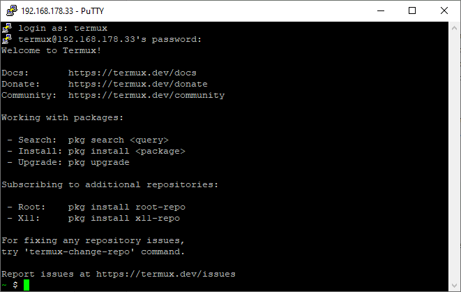
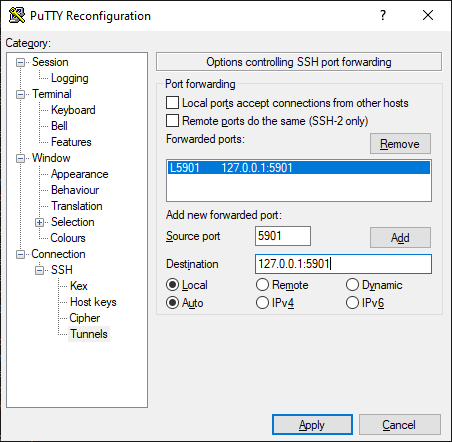
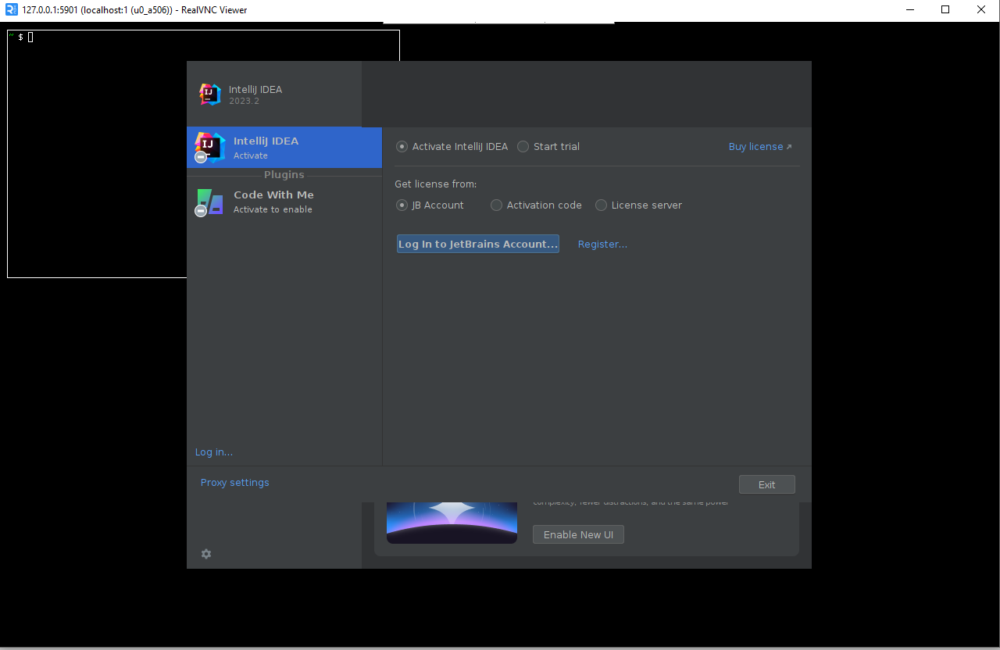
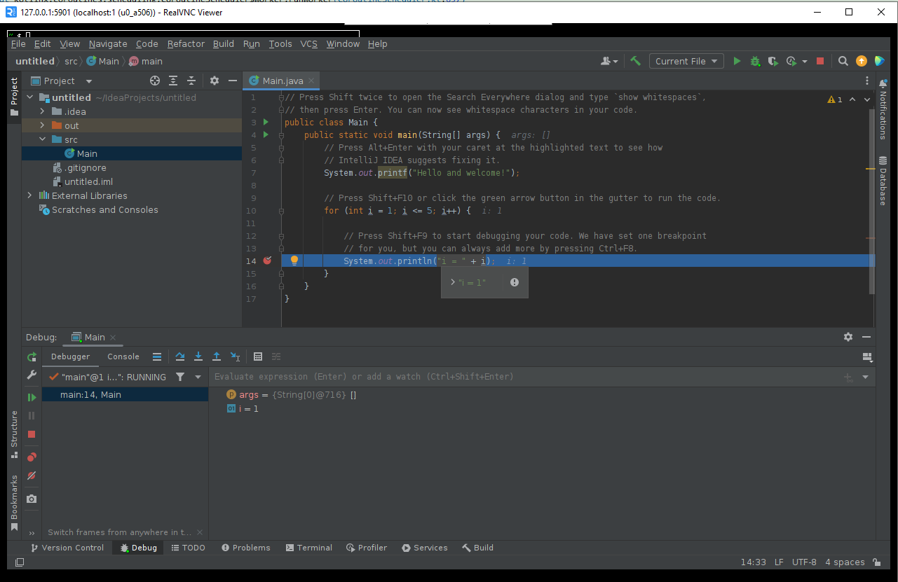
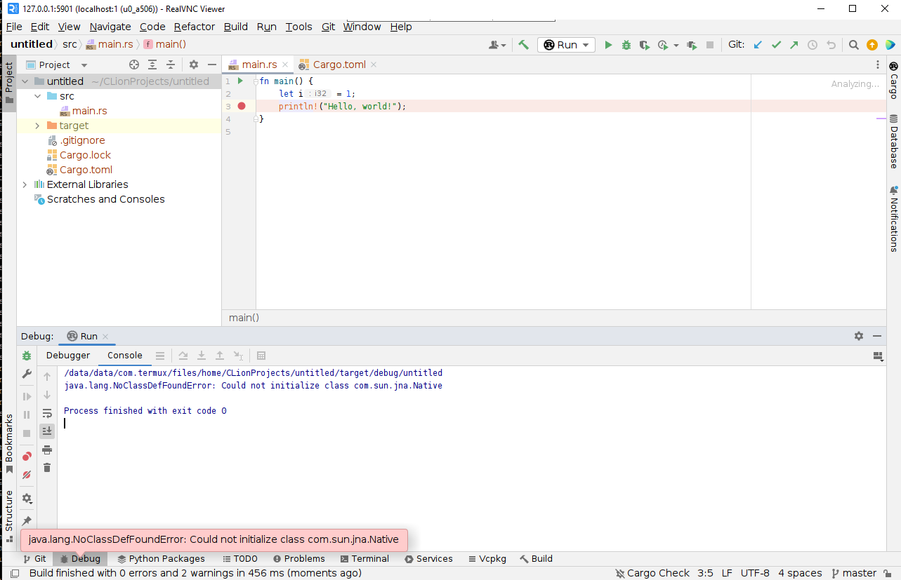
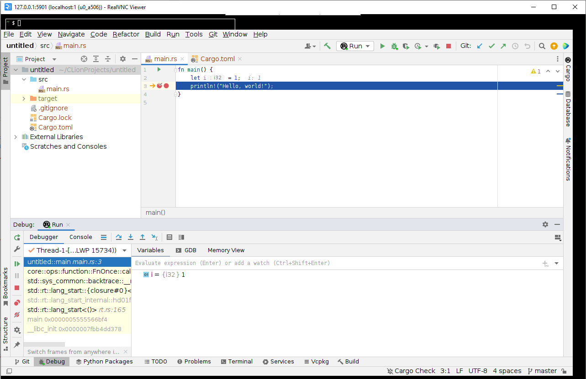

:hardbreaks-option:
= Running IDEA and CLion on Android
:toc:

== Introduction

Modern Android phones and tablets have excellent hardware - multi-core CPUs with several gigabytes of memory.
All this is quite enough to run even such heavy programs as IDEA and CLion.

image::img/intro.png[]

== Termux
On Android, you can run a Linux-like environment with some applications via Termux (https://github.com/termux/termux-app).
There were already several articles about him on Habré:
https://habr.com/en/articles/652633/[Termux access code]
https://habr.com/en/articles/444950/[Termux step by step (Part 1)]
https://habr.com/en/articles/445868/[Termux step by step (Part 2)]
https://habr.com/en/companies/sportmaster_lab/articles/683242/[Turning an old Android phone into a web server]

But in all these articles they only worked in Termux from the console. Now I will tell you how you can run full-fledged IDEs - IDEA and CLion - with a full-fledged UI on Android.

I use Samsung Galaxy Tab S6 (SM-T860/SM-T865) 10.5"
https://www.mobile-review.com/articles/2019/samsung-galaxy-tab-s6.shtml[An article from Mobile review about it]
With an additional Bluetooth keyboard (not native) with a touchpad - https://www.amazon.de/-/en/Bluetooth-Keyboard-Touchpad-Portable-Universal/dp/B08FWV1SYK[link to Amazon]

== Installation and configuration

First you need to download the latest apk. You can take them from Actions for the master branch https://github.com/termux/termux-app/actions
At the time of writing, this is https://github.com/termux/termux-app/actions/runs/5932694275
For the latest versions of Android, you need to take apk version 7 (*-android-7-*) - version 5 does not have many packages.
For my tablet it will be termux-app_v0.118.0+eef5ac4-apt-android-7-github-debug_arm64-v8a
Then nothing complicated - download the zip archive to your phone/tablet, unzip it, install the apk and launch it.

Now let's install all the packages that we need for work - ssh, java, gcc, etc...

[source,bash,linenums]
----
#connect the card
$termux-setup-storage
#updating dependencies
$ pkg upgrade
#repository for gcc
$ pkg install tur-repo
#repository for x11
$ pkg install x11-repo
#openssh - for remote connection
#openjdk-17 - java
#autoconf, automake, libtool, libffi-static, gcc-13 - for compiling broken dependencies
#termux-x11-nightly, tigervnc, fluxbox - for UI
#git, rust, gdb - for development
#proot-distro - for more comfortable IDE work
$ pkg install openssh openjdk-17 autoconf automake libtool libffi-static gcc-13 termux-x11-nightly tigervnc git rust gdb proot-distro
----

Now I recommend setting up SSH (if you ran the commands above, it should be installed) on Termux for remote connections - it will be a little more pleasant to set up.
The Termux Wiki has a great article on how to do this: https://wiki.termux.com/wiki/Remote_Access

Next, set the password and start ssh:
[source,bash,linenums]
----
$ passwd #set the password
New password:
Retype new password:
New password was successfully set.
$ sshd #start ssh daemon
----

You can connect via Putty on port 8022.

== Launch the IDE - sqlite and VNC

I’ll make a reservation right away - most of the difficulties are with the latest versions of the IDE (IDEA/CLion) - 2023.2.x. If you only need Java and can live on version 2023.1.5, then you can download the old IDEA from here https://www.jetbrains.com/idea/download/other.html and run it, specifying only IDEA_JDK. But I wanted to take full advantage of JetBrains products (it’s not for nothing that I have a full subscription to all their IDEs :-) )

We need Linux versions for the aarch64/ARM64 architecture: https://www.jetbrains.com/idea/download/other.html[IDEA], https://www.jetbrains.com/clion/download/other.html[CLion ]
Download and transfer to the Termux folder
[source,bash,linenums]
----
$ mkdir ide # folder for our ides
$cd ide
# copy
~/ide $ cp /data/data/com.termux/files/home/storage/shared/Download/ideaIU-2023.2-aarch64.tar.gz ./
~/ide $ cp /data/data/com.termux/files/home/storage/shared/Download/CLion-2023.2.tar.gz ./
#unzip
~/ide $ tar -xf ./ideaIU-2023.2-aarch64.tar.gz
~/ide $ tar -xf ./CLion-2023.2.tar.gz
----

Let's try to run:
[source,bash,linenums]
----
~/ide $ /data/data/com.termux/files/home/ide/clion-2023.2/bin/clion.sh
/data/data/com.termux/files/home/ide/clion-2023.2/bin/clion.sh: 176: exec: /data/data/com.termux/files/home/ide/clion-2023.2/jbr/ bin/java: not found
----
You need to specify the path to Java. We do:
[source,bash,linenums]
----
#java for clion
export CLION_JDK=/data/data/com.termux/files/usr/opt/openjdk/
#and for idea
export IDEA_JDK=/data/data/com.termux/files/usr/opt/openjdk/
----

We run and now the following error:
[source,bash,linenums]
----
~/ide $ /data/data/com.termux/files/home/ide/clion-2023.2/bin/clion.sh
libsqliteij error:
java.lang.AssertionError: Cannot create SvgCacheManager
         at com.intellij.openapi.diagnostic.DefaultLogger.error(DefaultLogger.java:54)
         at com.intellij.openapi.diagnostic.Logger.error(Logger.java:419)
         at com.intellij.ui.svg.SvgCacheManagerKt.createSvgCacheManager(SvgCacheManager.kt:62)
         at com.intellij.ui.svg.SvgCacheManagerKt$createSvgCacheManager$1.invokeSuspend(SvgCacheManager.kt)
         at kotlin.coroutines.jvm.internal.BaseContinuationImpl.resumeWith(ContinuationImpl.kt:33)
         at kotlinx.coroutines.internal.ScopeCoroutine.afterResume(Scopes.kt:32)
         at kotlinx.coroutines.AbstractCoroutine.resumeWith(AbstractCoroutine.kt:102)
         at kotlin.coroutines.jvm.internal.BaseContinuationImpl.resumeWith(ContinuationImpl.kt:46)
         at kotlinx.coroutines.DispatchedTask.run(DispatchedTask.kt:104)
         at kotlinx.coroutines.scheduling.CoroutineScheduler.runSafely(CoroutineScheduler.kt:584)
         at kotlinx.coroutines.scheduling.CoroutineScheduler$Worker.executeTask(CoroutineScheduler.kt:793)
         at kotlinx.coroutines.scheduling.CoroutineScheduler$Worker.runWorker(CoroutineScheduler.kt:697)
         at kotlinx.coroutines.scheduling.CoroutineScheduler$Worker.run(CoroutineScheduler.kt:684)
Caused by: java.lang.UnsatisfiedLinkError: /data/data/com.termux/files/home/ide/clion-2023.2/lib/native/linux-aarch64/libsqliteij.so: dlopen failed: library "libc.so.6 " not found: needed by /data/data/com.termux/files/home/ide/clion-2023.2/lib/native/linux-aarch64/libsqliteij.so in namespace (default)
         at java.base/jdk.internal.loader.NativeLibraries.load(Native Method)
         at java.base/jdk.internal.loader.NativeLibraries$NativeLibraryImpl.open(NativeLibraries.java:384)
         at java.base/jdk.internal.loader.NativeLibraries.loadLibrary(NativeLibraries.java:228)
         at java.base/jdk.internal.loader.NativeLibraries.loadLibrary(NativeLibraries.java:170)
         at java.base/java.lang.ClassLoader.loadLibrary(ClassLoader.java:2389)
         at java.base/java.lang.Runtime.load0(Runtime.java:751)
         at java.base/java.lang.System.load(System.java:1912)
         at org.jetbrains.sqlite.SqliteLibLoaderKt.loadSqliteNativeLibrary(sqliteLibLoader.kt:42)
         at org.jetbrains.sqlite.SqliteLibLoaderKt.loadNativeDb(sqliteLibLoader.kt:30)
         at org.jetbrains.sqlite.SqliteConnection.<init>(SqliteConnection.kt:32)
         at org.jetbrains.sqlite.SqliteConnection.<init>(SqliteConnection.kt:21)
         at com.intellij.ui.svg.SvgCacheManagerKt.connectToSvgCache(SvgCacheManager.kt:76)
         at com.intellij.ui.svg.SvgCacheManagerKt.access$connectToSvgCache(SvgCacheManager.kt:1)
         at com.intellij.ui.svg.SvgCacheManagerKt$createSvgCacheManager$2$1.invokeSuspend(SvgCacheManager.kt:53)
         at kotlin.coroutines.jvm.internal.BaseContinuationImpl.resumeWith(ContinuationImpl.kt:33)
         at kotlinx.coroutines.Dispatche1dTask.run(DispatchedTask.kt:106)
         at kotlinx.coroutines.internal.LimitedDispatcher$Worker.run(LimitedDispatcher.kt:115)
         at kotlinx.coroutines.scheduling.TaskImpl.run(Tasks.kt:100)
         ... 4 more
----

OK. Something new. Google - https://github.com/termux/termux-packages/issues/11606 https://wiki.termux.com/wiki/Differences_from_Linux
The problem is in glibc - Linux uses Glibc https://en.wikipedia.org/wiki/Glibc and Android uses Bionic https://en.wikipedia.org/wiki/Bionic_(software)
And here there are two options - try to install glibc https://github.com/termux-pacman/glibc-packages or recompile the libraries so that they use the necessary dependencies.
I tried the first option https://github.com/termux-pacman/glibc-packages/issues/61 It helped with some errors, but not all.
As a result, now I will tell you about the second one.

First, let's find out what kind of library libsqliteij is - the traces lead to IDEA https://github.com/search?q=repo%3AJetBrains%2Fintellij-community%20libsqliteij&type=code
Let's unpack git - we will download IDEA sources and recompile.

[source,bash,linenums]
----
~ $ git clone https://github.com/JetBrains/intellij-community.git
~ $ cd intellij-community/platform/sqlite/
----

Let's add linker options to include some dependencies. Without them the problem is at runtime.
In the make.sh file replace
linkFlags="-Wl,-S,-x"
on
linkFlags="-Wl,-S,-x,-lm,-lc,-ldl"

Next we indicate the OS, architecture and compiler - with the default clang there is a runtime error "cannot locate symbol "log""

[source,bash,linenums]
----
~/intellij-community/platform/sqlite $ export OS=linux
~/intellij-community/platform/sqlite $ export ARCH=aarch64
~/intellij-community/platform/sqlite $ export CC=gcc-13
~/intellij-community/platform/sqlite $ ./make.sh
----

After compilation, copy it to IDEA and CLion
[source,bash,linenums]
----
~/intellij-community/platform/sqlite $ cp ./target/sqlite/linux-aarch64/libsqliteij.so /data/data/com.termux/files/home/ide/clion-2023.2/lib/native/linux-aarch64 /
~/intellij-community/platform/sqlite $ cp ./target/sqlite/linux-aarch64/libsqliteij.so /data/data/com.termux/files/home/ide/idea-IU-232.8660.185/lib/native /linux-aarch64/
----

Let's launch:
[source,bash,linenums]
----
~/sqlite $ /data/data/com.termux/files/home/ide/clion-2023.2/bin/clion.sh
Start Failed
Unable to detect graphics environment
2023-08-18 22:13:27,505 [ 95] WARN - #c.i.i.AppStarter - Unable to load JNA library (os=Linux 4.14.190-26178195-abt865xxu5dwc3, jna.boot.library.path=/data/data/com .termux/files/home/ide/clion-2023.2/lib/jna/aarch64)
java.lang.UnsatisfiedLinkError: Unable to locate JNA native support library
         at com.sun.jna.Native.loadNativeDispatchLibrary(Native.java:1018)
         at com.sun.jna.Native.<clinit>(Native.java:221)
         at com.intellij.jna.JnaLoader.load(JnaLoader.java:19)
         at com.intellij.idea.StartupUtil$loadSystemLibsAndLogInfoAndInitMacApp$1$2.invokeSuspend(StartupUtil.kt:366)
         at kotlin.coroutines.jvm.internal.BaseContinuationImpl.resumeWith(ContinuationImpl.kt:33)
         at kotlinx.coroutines.DispatchedTask.run(DispatchedTask.kt:106)
         at kotlinx.coroutines.internal.LimitedDispatcher$Worker.run(LimitedDispatcher.kt:115)
         at kotlinx.coroutines.scheduling.TaskImpl.run(Tasks.kt:100)
         at kotlinx.coroutines.scheduling.CoroutineScheduler.runSafely(CoroutineScheduler.kt:584)
         at kotlinx.coroutines.scheduling.CoroutineScheduler$Worker.executeTask(CoroutineScheduler.kt:793)
         at kotlinx.coroutines.scheduling.CoroutineScheduler$Worker.runWorker(CoroutineScheduler.kt:697)
         at kotlinx.coroutines.scheduling.CoroutineScheduler$Worker.run(CoroutineScheduler.kt:684)
----

The "Unable to detect graphics environment" error can be easily resolved - you need to start the graphics environment. In our case it will be X11 or VNC. X11 seems to work faster and supports GPU acceleration, but unfortunately copy-paste between Android and Termux only works in one direction - from Termux to Android. This was critical for me, so I chose VNC.
Here is a comprehensive article on setting up VNC for Termux:
https://wiki.termux.com/wiki/Graphical_Environment

If you ran the commands at the beginning of the article, then VNC is already installed. You just need to configure it.
[source,bash,linenums]
----
~$ vncserver -localhost
You will require a password to access your desktops.
Password:
Verify:
Would you like to enter a view-only password (y/n)? n

New 'localhost:1()' desktop is localhost:1

Creating default startup script /data/data/com.termux/files/home/.vnc/xstartup
Creating default config /data/data/com.termux/files/home/.vnc/config
Starting applications specified in /data/data/com.termux/files/home/.vnc/xstartup
Log file is /data/data/com.termux/files/home/.vnc/localhost:1.log
----
It will open on port 5901 for DISPLAY = 1, 5902 for 2, and so on.

I chose RealVNC Viewer as a VNC client for Windows and Android
Windows https://www.realvnc.com/en/connect/download/viewer/
Android https://play.google.com/store/apps/details?id=com.realvnc.viewer.android

Well, I also configured port forwarding for VNC - so that the VNC client connects via localhost. But this is not important.

Next, set the DISPLAY environment variable and launch the IDE:
[source,bash,linenums]
----
~ $ export DISPLAY=":1"
~ $ export CLION_JDK=/data/data/com.termux/files/usr/opt/openjdk/
~ $ /data/data/com.termux/files/home/ide/clion-2023.2/bin/clion.sh
----

If you have an error with SvgCacheManager, then you need to add -Didea.ui.icons.svg.disk.cache=false to clion64.vmoptions and idea64.vmoptions:
[source,bash,linenums]
----
~ $ /data/data/com.termux/files/home/ide/idea-IU-232.8660.185/bin/idea.sh
CompileCommand: exclude com/intellij/openapi/vfs/impl/FilePartNodeRoot.trieDescend bool exclude = true
ERROR: Cannot create SvgCacheManager
java.lang.UnsatisfiedLinkError: 'int org.jetbrains.sqlite.NativeDB.open(byte[], int)'
        at org.jetbrains.sqlite.NativeDB.open(Native Method)
        at org.jetbrains.sqlite.NativeDB.open(NativeDB.kt:59)
        at org.jetbrains.sqlite.SqliteConnection.<init>(SqliteConnection.kt:36)
        at org.jetbrains.sqlite.SqliteConnection.<init>(SqliteConnection.kt:21)
        at com.intellij.ui.svg.SvgCacheManagerKt.connectToSvgCache(SvgCacheManager.kt:76)
        at com.intellij.ui.svg.SvgCacheManagerKt.access$connectToSvgCache(SvgCacheManager.kt:1)
        at com.intellij.ui.svg.SvgCacheManagerKt$createSvgCacheManager$2$1.invokeSuspend(SvgCacheManager.kt:53)
        at kotlin.coroutines.jvm.internal.BaseContinuationImpl.resumeWith(ContinuationImpl.kt:33)
        at kotlinx.coroutines.DispatchedTask.run(DispatchedTask.kt:106)
        at kotlinx.coroutines.internal.LimitedDispatcher$Worker.run(LimitedDispatcher.kt:115)
        at kotlinx.coroutines.scheduling.TaskImpl.run(Tasks.kt:100)
        at kotlinx.coroutines.scheduling.CoroutineScheduler.runSafely(CoroutineScheduler.kt:584)
        at kotlinx.coroutines.scheduling.CoroutineScheduler$Worker.executeTask(CoroutineScheduler.kt:793)
        at kotlinx.coroutines.scheduling.CoroutineScheduler$Worker.runWorker(CoroutineScheduler.kt:697)
        at kotlinx.coroutines.scheduling.CoroutineScheduler$Worker.run(CoroutineScheduler.kt:684)

Start Failed
Internal error. Please refer to https://jb.gg/ide/critical-startup-errors

java.lang.AssertionError: Cannot create SvgCacheManager
        at com.intellij.openapi.diagnostic.DefaultLogger.error(DefaultLogger.java:54)
        at com.intellij.openapi.diagnostic.Logger.error(Logger.java:419)
        at com.intellij.ui.svg.SvgCacheManagerKt.createSvgCacheManager(SvgCacheManager.kt:62)
        at com.intellij.ui.svg.SvgCacheManagerKt$createSvgCacheManager$1.invokeSuspend(SvgCacheManager.kt)
        at kotlin.coroutines.jvm.internal.BaseContinuationImpl.resumeWith(ContinuationImpl.kt:33)
        at kotlinx.coroutines.internal.ScopeCoroutine.afterResume(Scopes.kt:32)
        at kotlinx.coroutines.AbstractCoroutine.resumeWith(AbstractCoroutine.kt:102)
        at kotlin.coroutines.jvm.internal.BaseContinuationImpl.resumeWith(ContinuationImpl.kt:46)
        at kotlinx.coroutines.DispatchedTask.run(DispatchedTask.kt:104)
        at kotlinx.coroutines.scheduling.CoroutineScheduler.runSafely(CoroutineScheduler.kt:584)
        at kotlinx.coroutines.scheduling.CoroutineScheduler$Worker.executeTask(CoroutineScheduler.kt:793)
        at kotlinx.coroutines.scheduling.CoroutineScheduler$Worker.runWorker(CoroutineScheduler.kt:697)
        at kotlinx.coroutines.scheduling.CoroutineScheduler$Worker.run(CoroutineScheduler.kt:684)
Caused by: java.lang.UnsatisfiedLinkError: 'int org.jetbrains.sqlite.NativeDB.open(byte[], int)'
        at org.jetbrains.sqlite.NativeDB.open(Native Method)
        at org.jetbrains.sqlite.NativeDB.open(NativeDB.kt:59)
        at org.jetbrains.sqlite.SqliteConnection.<init>(SqliteConnection.kt:36)
        at org.jetbrains.sqlite.SqliteConnection.<init>(SqliteConnection.kt:21)
        at com.intellij.ui.svg.SvgCacheManagerKt.connectToSvgCache(SvgCacheManager.kt:76)
        at com.intellij.ui.svg.SvgCacheManagerKt.access$connectToSvgCache(SvgCacheManager.kt:1)
        at com.intellij.ui.svg.SvgCacheManagerKt$createSvgCacheManager$2$1.invokeSuspend(SvgCacheManager.kt:53)
        at kotlin.coroutines.jvm.internal.BaseContinuationImpl.resumeWith(ContinuationImpl.kt:33)
        at kotlinx.coroutines.DispatchedTask.run(DispatchedTask.kt:106)
        at kotlinx.coroutines.internal.LimitedDispatcher$Worker.run(LimitedDispatcher.kt:115)
        at kotlinx.coroutines.scheduling.TaskImpl.run(Tasks.kt:100)
        ... 4 more
----

Finally you will be able to see the start screen:

Let's create a simple project and run it immediately with debug to check all development capabilities:

Everything is working!
Now let's try to launch CLion with debug:

JNA doesn't work. We will fix it by analogy with sqlite.

== JNA in Termux

To rebuild libjnidispatch.so from JNA, you must first find out the version of libjnidispatch.so that is used in the IDE. This is exactly the JNI version of the library in JNA, not the JNA version itself. If you just build the latest version, the IDE will not start with an error.

You can view the current JNI version in <IDE>/lib/util-8.jar/com/sun/jna/Version.class
For IDEA/CLion 2023.2.0 this is 6.1.4.
Now download JNA and find native version 6.1.4 in the build.xml file (lines 79-81, jni.major, jni.minor, jni.revision variables)
[source,bash,linenums]
----
~ $ git clone https://github.com/java-native-access/jna.git
~$cdjna
~/jna $ git log -L79,81:./build.xml

commit f6ebc9f3314e016094b7e1c784e68998c63de895
Author: Matthias Bläsing <mblaesing@doppel-helix.eu>
Date: Sun Jun 5 19:53:06 2022 +0200

     Rebuild native libraries

diff --git a/build.xml b/build.xml
--- a/build.xml
+++b/build.xml
@@ -77.4 +77.4 @@
    <property name="jni.major" value="6"/>
    <property name="jni.minor" value="1"/>
- <property name="jni.revision" value="3"/>
+ <property name="jni.revision" value="4"/>
    <property name="jni.build" value="0"/> <!--${build.number}-->
----

We need commit f6ebc9f3314e016094b7e1c784e68998c63de895. We perform checkout and collect:
[source,bash,linenums]
----
~/jna $ git checkout f6ebc9f3314e016094b7e1c784e68998c63de895
~/jna $ ant -Dos.prefix=android-aarch64
----

Error with libffi:
[source,bash,linenums]
----
      [exec] make: *** [Makefile:510: /data/data/com.termux/files/home/jna/build/native-android-aarch64/libffi/.libs/libffi.a] Error 1
----

Since we previously installed libffi-static, we simply copy it to the expected location and restart the build:
[source,bash,linenums]
----
~/jna $ mkdir -p /data/data/com.termux/files/home/jna/build/native-android-aarch64/libffi/.libs/
~/jna $ cp /data/data/com.termux/files/usr/lib/libffi.a /data/data/com.termux/files/home/jna/build/native-android-aarch64/libffi/.libs /libffi.a
~/jna $ ant -Dos.prefix=android-aarch64
----

Let's run further:
[source,bash,linenums]
----
      [exec] aarch64-linux-android-gcc --sysroot /Developer/Applications/android-ndk-r10e/platforms/android-21/arch-arm64 -W -Wall -Wno-unused -Wno-parentheses -O2 -fno- omit-frame-pointer -fno-strict-aliasing -fpic -ffunction-sections -funwind-tables -fno-short-enums -DNO_JAWT -DNO_WEAK_GLOBALS -DFFI_MMAP_EXEC_WRIT=1 -DFFI_MMAP_EXEC_SELINUX=0 -I"/data/data/com.termux /files/home/jna/build/headers" -I/data/data/com.termux/files/home/jna/build/native-android-aarch64/libffi/include -I"/Developer/Applications/android-ndk -r10e/platforms/android-21/arch-arm64/usr/include" -DJNA_JNI_VERSION='"6.1.4"' -DCHECKSUM='"147a998f0cbc89681a1ae6c0dd121629"' -Wno-unknown-warning-option -Werror -Wno-clobbered - Wno-unused-variable -c dispatch.c -o /data/data/com.termux/files/home/jna/build/native-android-aarch64/dispatch.o
      [exec] In file included from dispatch.c:30:
      [exec] ./dispatch.h:29:10: fatal error: 'ffi.h' file not found
      [exec] #include "ffi.h"
      [exec] ^~~~~~~
      [exec] 1 error generated.
      [exec] make: *** [Makefile:463: /data/data/com.termux/files/home/jna/build/native-android-aarch64/dispatch.o] Error 1

BUILD FAILED
/data/data/com.termux/files/home/jna/build.xml:1127: exec returned: 2
----

Missing header files. Add to native/Makefile, line 178:
[source,makefile,linenums]
----
CINCLUDES+=-I"$(NDK_PLATFORM)/arch-$(AARCH)/usr/include" -I"/data/data/com.termux/files/usr/include/" # -I/usr/include
----

Let's start ant again:
[source,bash,linenums]
----
native:
     [exec] aarch64-linux-android-gcc --sysroot /Developer/Applications/android-ndk-r10e/platforms/android-21/arch-arm64 -W -Wall -Wno-unused -Wno-parentheses  -O2 -fno-omit-frame-pointer -fno-strict-aliasing -fpic -ffunction-sections -funwind-tables -fno-short-enums  -DNO_JAWT -DNO_WEAK_GLOBALS -DFFI_MMAP_EXEC_WRIT=1 -DFFI_MMAP_EXEC_SELINUX=0  -I"/data/data/com.termux/files/home/jna/build/headers" -I/data/data/com.termux/files/home/jna/build/native-android-aarch64/libffi/include -I"/Developer/Applications/android-ndk-r10e/platforms/android-21/arch-arm64/usr/include" -I"/data/data/com.termux/files/usr/include/"  -DJNA_JNI_VERSION='"6.1.4"' -DCHECKSUM='"147a998f0cbc89681a1ae6c0dd121629"' -Wno-unknown-warning-option -Werror -Wno-clobbered -Wno-unused-variable -c dispatch.c -o /data/data/com.termux/files/home/jna/build/native-android-aarch64/dispatch.o
     [exec] In file included from dispatch.c:98:
     [exec] In file included from /data/data/com.termux/files/usr/include/stdlib.h:276:
     [exec] /data/data/com.termux/files/usr/include/android/legacy_stdlib_inlines.h:96:77: error: unused parameter '__l' [-Werror,-Wunused-parameter]
     [exec] static __inline double strtod_l(const char* __s, char** __end_ptr, locale_t __l) {
     [exec]                                                                             ^
     [exec] /data/data/com.termux/files/usr/include/android/legacy_stdlib_inlines.h:100:76: error: unused parameter '__l' [-Werror,-Wunused-parameter]
     [exec] static __inline float strtof_l(const char* __s, char** __end_ptr, locale_t __l) {
     [exec]                                                                            ^
     [exec] /data/data/com.termux/files/usr/include/android/legacy_stdlib_inlines.h:104:87: error: unused parameter '__l' [-Werror,-Wunused-parameter]
     [exec] static __inline long strtol_l(const char* __s, char** __end_ptr, int __base, locale_t __l) {
     [exec]                                                                                       ^
     [exec] 3 errors generated.
     [exec] make: *** [Makefile:463: /data/data/com.termux/files/home/jna/build/native-android-aarch64/dispatch.o] Error 1

BUILD FAILED
/data/data/com.termux/files/home/jna/build.xml:1127: exec returned: 2
----

Now there are errors with unused parameter. OK. We simply add compilation options to ignore this error in native/Makefile, line 97:
[source,makefile,linenums]
----
PCFLAGS=-W -Wall -Wno-unused -Wno-parentheses -Wno-unused-parameter
----

Finally everything comes together. Copy the library libjnidispatch.so:
[source,bash,linenums]
----
~ $ cp jna/build/native-android-aarch64/libjnidispatch.so ide/clion-2023.2/lib/jna/aarch64/
----

Launch CLion and try to run debug again:
[source,bash,linenums]
----
         Suppressed: java.lang.UnsatisfiedLinkError: dlopen failed: library "libc.so.6" not found: needed by /data/data/com.termux/files/home/ide/clion-2023.2/lib/pty4j/linux/aarch64 /libpty.so in namespace (default)
                 at com.sun.jna.Native.open(Native Method)
                 at com.sun.jna.NativeLibrary.loadLibrary(NativeLibrary.java:197)
                 ... 28 more
         Suppressed: java.lang.UnsatisfiedLinkError: dlopen failed: library "libc.so.6" not found: needed by /data/data/com.termux/files/home/ide/clion-2023.2/lib/pty4j/linux/aarch64 /libpty.so in namespace (default)
                 at com.sun.jna.Native.open(Native Method)
                 at com.sun.jna.NativeLibrary.loadLibrary(NativeLibrary.java:210)
                 ... 28 more
         Suppressed: java.io.IOException: Native library (data/data/com.termux/files/home/ide/clion-2023.2/lib/pty4j/linux/aarch64/libpty.so) not found in resource path (/data/ data/com.termux/files/home/ide/clion-2023.2/lib/platform-loader.jar:/data/data/com.termux/files/home/ide/clion-2023.2/lib/util.jar:/ data/data/com.termux/files/home/ide/clion-2023.2/lib/app.jar:/data/data/com.termux/files/home/ide/clion-2023.2/lib/util-8.jar :/data/data/com.termux/files/home/ide/clion-2023.2/lib/util_rt.jar:/data/data/com.termux/files/home/ide/clion-2023.2/lib/jps-model .jar:/data/data/com.termux/files/home/ide/clion-2023.2/lib/stats.jar:/data/data/com.termux/files/home/ide/clion-2023.2/lib/protobuf .jar:/data/data/com.termux/files/home/ide/clion-2023.2/lib/external-system-rt.jar:/data/data/com.termux/files/home/ide/clion-2023.2 /lib/intellij-test-discovery.jar:/data/data/com.termux/files/home/ide/clion-2023.2/lib/forms_rt.jar:/data/data/com.termux/files/home/ide /clion-2023.2/lib/rd.jar:/data/data/com.termux/files/home/ide/clion-2023.2/lib/externalProcess-rt.jar:/data/data/com.termux/files/home /ide/clion-2023.2/lib/annotations-java5.jar:/data/data/com.termux/files/home/ide/clion-2023.2/lib/app-client.jar:/data/data/com.termux /files/home/ide/clion-2023.2/lib/async-profiler.jar:/data/data/com.termux/files/home/ide/clion-2023.2/lib/bouncy-castle.jar:/data/data /com.termux/files/home/ide/clion-2023.2/lib/byte-buddy-agent.jar:/data/data/com.termux/files/home/ide/clion-2023.2/lib/error-prone- annotations.jar:/data/data/com.termux/files/home/ide/clion-2023.2/lib/groovy.jar:/data/data/com.termux/files/home/ide/clion-2023.2/lib/ grpc.jar:/data/data/com.termux/files/home/ide/clion-2023.2/lib/intellij-coverage-agent-1.0.723.jar:/data/data/com.termux/files/home/ ide/clion-2023.2/lib/jetbrains-annotations.jar:/data/data/com.termux/files/home/ide/clion-2023.2/lib/jsch-agent.jar:/data/data/com.termux/ files/home/ide/clion-2023.2/lib/junit4.jar:/data/data/com.termux/files/home/ide/clion-2023.2/lib/junit5.jar:/data/data/com.termux/ files/home/ide/clion-2023.2/lib/lib-client.jar:/data/data/com.termux/files/home/ide/clion-2023.2/lib/lib.jar:/data/data/com. termux/files/home/ide/clion-2023.2/lib/modules.jar:/data/data/com.termux/files/home/ide/clion-2023.2/lib/product-client.jar:/data/data/ com.termux/files/home/ide/clion-2023.2/lib/product.jar)
                 at com.sun.jna.Native.extractFromResourcePath(Native.java:1145)
                 at com.sun.jna.NativeLibrary.loadLibrary(NativeLibrary.java:281)
                 ... 28 more
----

== PTY4J - so and jar

Now the error is in the libpty.so library. pty4j is a library from JetBrains for easily running console applications. Well now it's her turn:
[source,bash,linenums]
----
~ $ git clone https://github.com/JetBrains/pty4j.git
~$cd~/pty4j/native
~/pty4j/native $ make -f Makefile_linux linux_aarch64
----

Copy, restart IDE and debug:

[source,bash,linenums]
----
/pty4j/native $ cp ../os/linux/aarch64/libpty.so ~/ide/clion-2023.2/lib/pty4j/linux/aarch64/
----

Now there is an error loading libutil.so:

[source,bash,linenums]
----
Suppressed: java.lang.UnsatisfiedLinkError: dlopen failed: library "libutil.so" not found
             at com.sun.jna.Native.open(Native Method)
             at com.sun.jna.NativeLibrary.loadLibrary(NativeLibrary.java:197)
             ... 28 more
     Suppressed: java.lang.UnsatisfiedLinkError: dlopen failed: library "libutil.so" not found
             at com.sun.jna.Native.open(Native Method)
             at com.sun.jna.NativeLibrary.loadLibrary(NativeLibrary.java:210)
             ... 28 more
----

It's still pty4j, but in a different location:
https://github.com/JetBrains/pty4j/blob/master/src/com/pty4j/unix/linux/OSFacadeImpl.java#L79

[source,java]
----
  public interface Linux_Util_lib extends Library {
    int login_tty(int fd);
  }
//...
  private static final Linux_Util_lib m_Utillib = Native.loadLibrary("util", Linux_Util_lib.class);
----

The Linux implementation tries to load the util library, but does not find it in Termux. But it is in the "c" library, which is already used in this code! To do this, we transfer the only function "int login_tty(int fd);" from Linux_Util_lib to C_lib and remove all references to Linux_Util_lib from OSFacadeImpl, replacing it also at the point of use:
[source,java]
----
   private interface C_lib extends Library {
//...
     int login_tty(int fd);
   }

   @Override
   public int login_tty(int fd) {
     return m_Clib.login_tty(fd);
   }
----

And we collect the jar without tests (they crash on Android):
[source,bash,linenums]
----
~/pty4j $ gradlew -x tests -x testJar
----

Copy the resulting jar to the <IDE>/lib folder and add this file to the classpath at the beginning of idea.sh/clion.sh:
[source,bash,linenums]
----
~ $ cp ~/pty4j/build/libs/pty4j-0.12.13.jar ~/ide/clion-2023.2/lib/
----

CLASS_PATH="$IDE_HOME/lib/pty4j-0.12.13.jar:$IDE_HOME/lib/platform-loader.jar"

We restart again and run debug, everything works!

== A little convenience - proot, window manager
In IDEs launched by default from Termux, file opening dialogs do not work well, since the root file system is not accessible. To do this you need to run the IDE via root:
https://wiki.termux.com/wiki/PRoot

This is to some extent an emulator of the root environment - applications will think that they are running under root. In fact, there will be no root access.

And if you start the IDE as is, immediately after VNC/X11, there will be black frames around the window. To fix this, you must first launch the window manager.
https://wiki.termux.com/wiki/Graphical_Environment
I used Fluxbox.

== My commands to run:
Here I will give all the commands that I use to launch IDEA/CLion. For convenience, they can be placed in a sh file or added (for example, export) to bashrc:
[source,bash,linenums]
----
#launch proot
~ $ proot-distro login ubuntu --shared-tmp
#specify the display and launch VNC
# with a resolution equal to half the resolution of my tablet, so that everything would not be so small and I would not have to scale (and so that resources would not be wasted on rendering)
~ $ export DISPLAY=":1"
~ $ vncserver -localhost -geometry 1280x800 -depth 24
#specify java for IDEA - for compiling java and for launching the IDE itself and for launching CLion
~ $ export JAVA_HOME=/data/data/com.termux/files/usr/opt/openjdk/
~ $ export IDEA_JDK=/data/data/com.termux/files/usr/opt/openjdk/
~ $ export CLION_JDK=/data/data/com.termux/files/usr/opt/openjdk/
#window manager
~$fluxbox&
#launch IDE
~ $ /data/data/com.termux/files/home/ide/idea-IU-232.8660.185/bin/idea.sh &
~ $ /data/data/com.termux/files/home/ide/clion-2023.2/bin/clion.sh &
----

== Compiled so and jar files
Surely you don’t want to go through this whole thorny path of compiling all the libraries. So I posted the already compiled files with brief instructions on where to copy them:
https://github.com/TimReset/termux_jetbrains